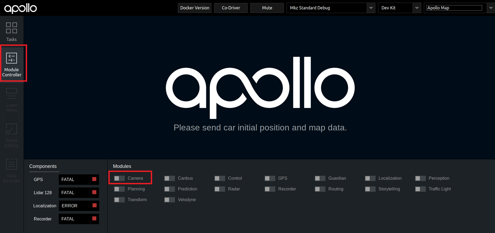
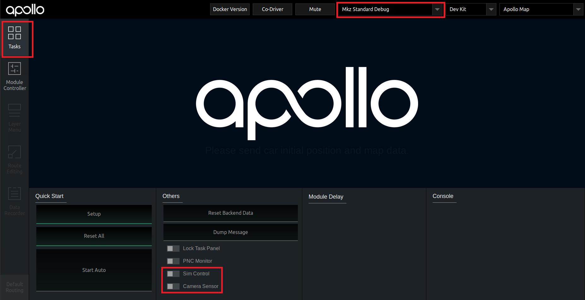

# 基于双目感知的封闭园区自动驾驶搭建--设备集成

## 前提条件

 - 完成了[循迹搭建--车辆循迹演示](../Waypoint_Following/start_waypoint_following_cn.md)
 
## 主要步骤

 - 摄像头安装配置与数据验证。

### 摄像头型号说明

- 摄像头型号：smartereye S1双目相机。 

- smartereye S1双目相机采用标准RJ45的网络接口，由北京中科慧眼科技有限公司制造。

- 更多详细参数可参考中科慧眼官网：[Smartereye S1](http://www.smartereye.com/product/S1)。

### 摄像头安装配置与数据验证

- 牢固安装在小车结构架的竖杆上，水平安装，镜头保持清洁，避免影响图像采集。安装后的效果如下图所示：


### 摄像头与工控机连接
 
 - 用车上的电源给相机供电。
 
 - 用网线将设备连接在IPC的网络接口上。

 - 向双目相机的供应厂询问设备的IP地址，例如设备的IP地址为192.168.1.251；在IPC的终端中ping 192.168.1.251，能ping通则表示相机和IPC之间的网络是通的。

 - 参考双目相机的官网文档对相机做一下相关的配置：[Smartereye S1](http://www.smartereye.com/product/S1)。

### 摄像头的启动
 
 - 运行`git clone https://github.com/ApolloAuto/apollo-contrib.git`命令将apollo-contrib仓库克隆至本地，然后将apollo-contrib文件夹下面的smartereye文件夹整体拷贝到/apollo目录下。
 
 - 启动docker环境，在docker环境中输入以下命令：

 ```
 sudo bash /apollo/smartereye/install.sh /apollo/third_party/camera_library/smartereye
 ```

 将smartereye的共享库拷贝至apollo的对应的位置。删除`/apollo/smartereye`文件夹。

 - 将`/apollo/modules/dreamview/conf/hmi_modes/mkz_standard_debug.pb.txt`文件中的第四行的内容`dag_files: "/apollo/modules/drivers/camera/dag/camera.dag"`修改为`dag_files: "/apollo/modules/drivers/smartereye/dag/smartereye.dag"`并保存；将`/apollo/modules/common/data/global_flagfile.txt`文件中的末尾添加下面一行：`--image_short_topic=/apollo/sensor/smartereye/image/compressed`并保存。

 - 确保apollo被正确编译。
 
 - 启动DreamView： `bash /apollo/scripts/bootstrap.sh`，并在浏览器中输入DreamView地址：`http://localhost:8888/`
 
 - 在`Module Controller`标签栏下，打开`Camera`开关，开关位置如下图所示：
 


 - 在`Tasks`标签栏下依次打开`SimControl`和`Camera Sensor`开关，`Camera Sensor`打开后，务必关闭`SimControl`。选择`Mkz Standard Debug`模式，开关在dreamview界面的位置如下图所示：
 

 
 - 如果一切正常，则会在`DreamView`右下角出现摄像头采集的图像。
 
 - 在正确完成上述步骤后，在`docker`环境内使用`cyber_monitor`工具，查看`/apollo/sensor/smartereye/image`、`/apollo/sensor/smartereye/image/compressed`是否有数据输出，且帧率是否稳定在15帧左右。

```
//输入如下命令启动cyber_monitor
budaoshi@in_dev_docker:/apollo$ cyber_monitor
```