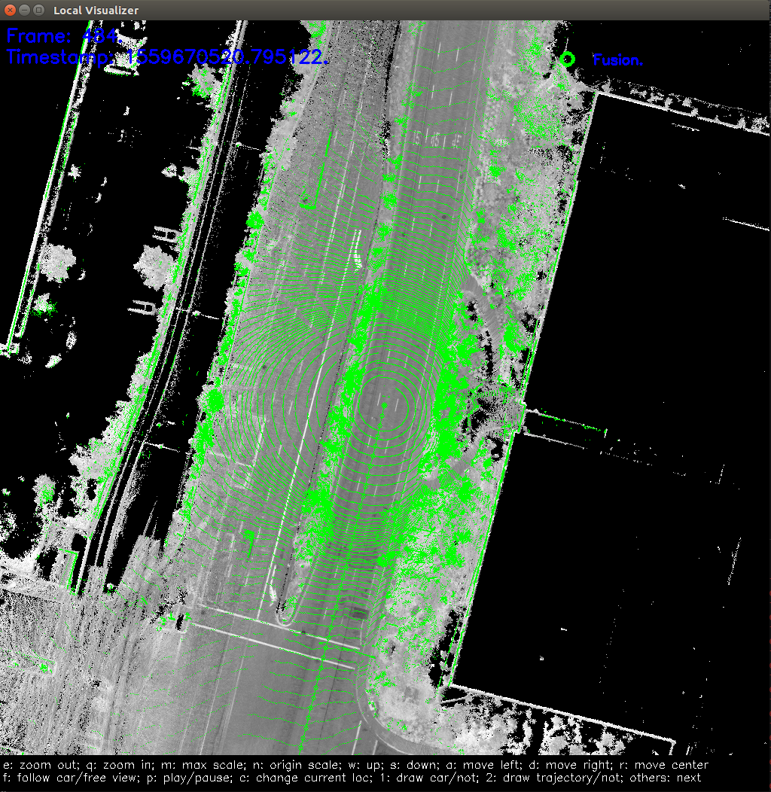

# How to Run RTK Localization Module On Your Local Computer

## 1. Preparation
 - Download source code of Apollo from [GitHub](https://github.com/ApolloAuto/apollo)
 - Follow the tutorial to set up [docker environment](../quickstart/apollo_software_installation_guide.md).
 - Download localization data from [Apollo Data Open Platform](http://data.apollo.auto/?name=sensor%20data&data_key=multisensor&data_type=1&locale=en-us&lang=en)（US only).

## 2. Build Apollo

First check and make sure you are in Apollo Development Docker container before you proceed. Now you will need to build from the source.

```
# (Optional) To make sure you start clean
bash apollo.sh clean

bash apollo.sh build_opt
```

## 3. Run the RTK localization module

```
cyber_launch start /apollo/modules/localization/launch/rtk_localization.launch
```

In /apollo/data/log directory, you can see the localization log files.
 - localization.INFO : INFO log
 - localization.WARNING : WARNING log
 - localization.ERROR : ERROR log
 - localization.out : Redirect standard output
 - localizaiton.flags : A backup of configuration file

## 5. Play cyber records
In the downloaded data, you can find a folder named *apollo3.5*. Let's assume the path of this folder as DATA_PATH.
```
cd DATA_PATH/records
cyber_recorder play -f record.*
```

## 6. Record and Visualize localization result (optional)

### Visualize Localization result
```
cyber_launch start /apollo/modules/localization/launch/msf_visualizer.launch
```
First, the visualization tool will generate a series of cache files from the localization map, which will be stored in the /apollo/cyber/data/map_visual directory.

Then it will receive the topics listed below and draw them on screen.
 - /apollo/sensor/lidar128/compensator/PointCloud2
 - /apollo/localization/pose

If everything is fine, you should see this on screen.


