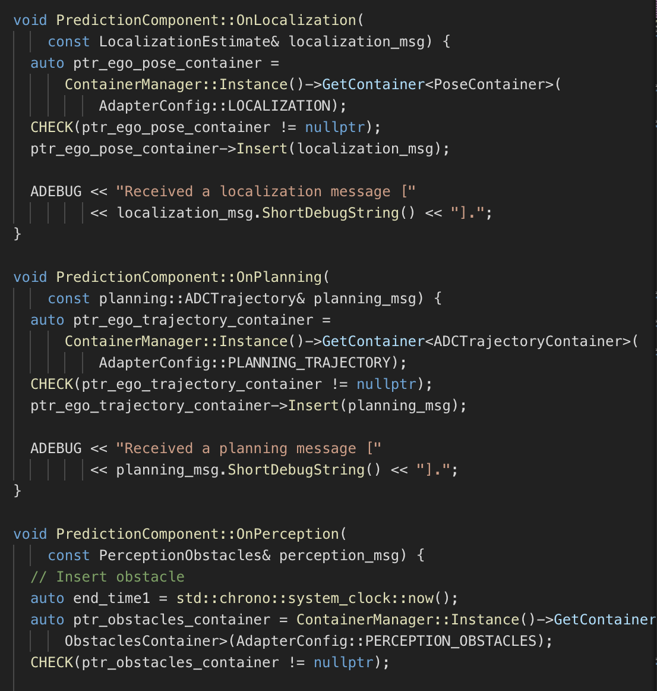
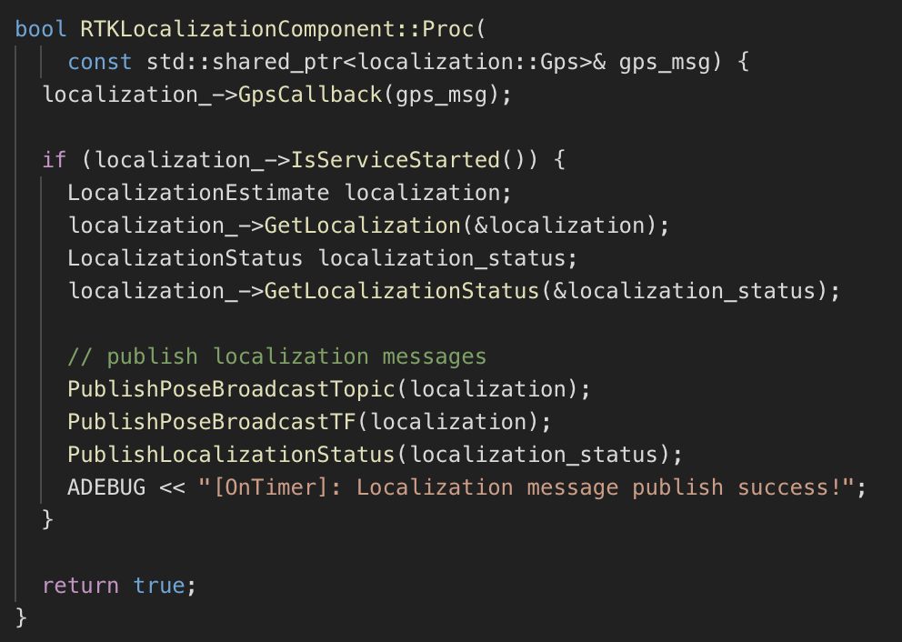
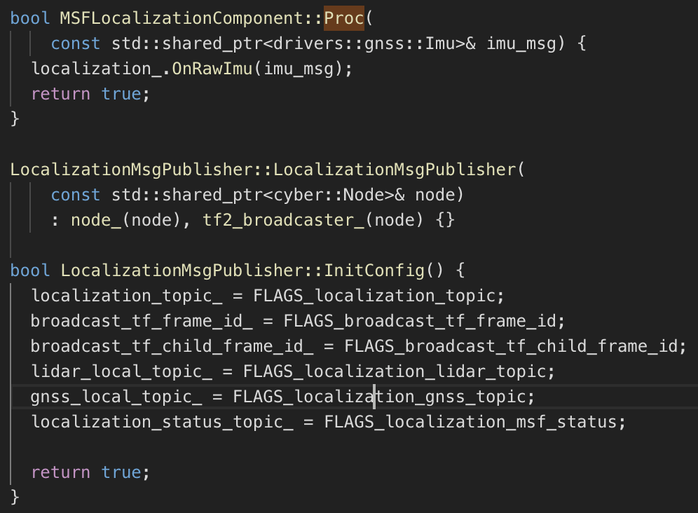
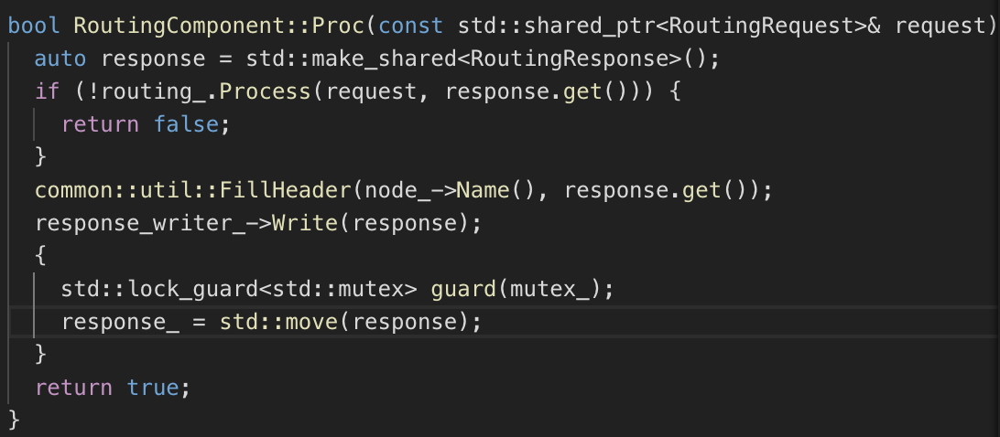
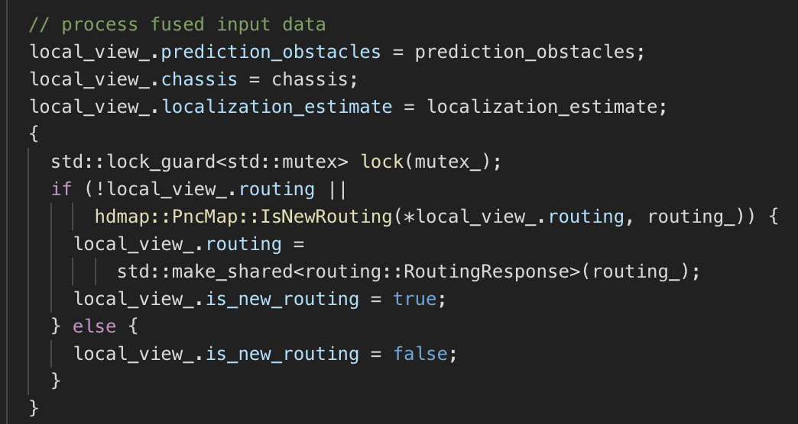
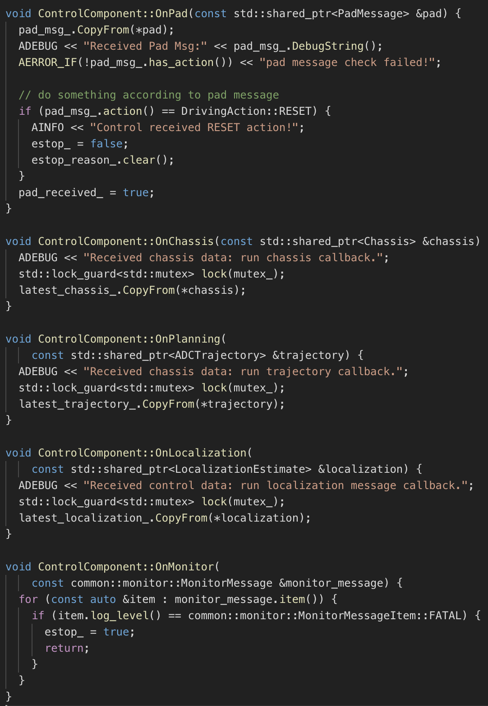
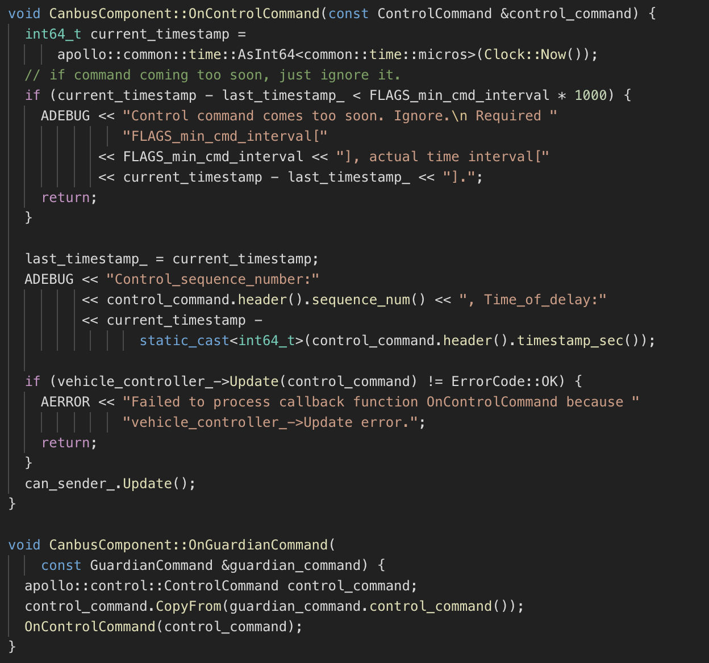

# Apollo 5.5 Software Architecture

Core software modules running on the Apollo 3.5 powered autonomous vehicle include:

- **Perception** — The perception module identifies the world surrounding the autonomous vehicle. There are two important submodules inside perception: obstacle detection and traffic light detection.
- **Prediction** — The prediction module anticipates the future motion trajectories of the perceived obstacles.
- **Routing** — The routing module tells the autonomous vehicle how to reach its destination via a series of lanes or roads.
- **Planning** — The planning module plans the spatio-temporal trajectory for the autonomous vehicle to take.
- **Control** — The control module executes the planned spatio-temporal trajectory by generating control commands such as throttle, brake, and steering.
- **CanBus** — The CanBus is the interface that passes control commands to the vehicle hardware. It also passes chassis information to the software system.
- **HD-Map** — This module is similar to a library. Instead of publishing and subscribing messages, it frequently functions as query engine support to provide ad-hoc structured information regarding the roads.
- **Localization** — The localization module leverages various information sources such as GPS, LiDAR and IMU to estimate where the autonomous vehicle is located.
- **HMI** - Human Machine Interface or DreamView in Apollo is a module for viewing the status of the vehicle, testing other modules and controlling the functioning of the vehicle in real-time.
- **Monitor** - The surveillance system of all the modules in the vehicle including hardware.
- **Guardian** - A new safety module that performs the function of an Action Center and intervenes should Monitor detect a failure.
- **Storytelling** - A new module that isolates and manages complex scenarios, creating stories that would trigger multiple modules' actions. All other modules can subscribe to this particular module.

```
Note: Detailed information on each of these modules is included below.
```

The interactions of these modules are illustrated in the picture below.


Every module is running as a separate CarOS-based ROS node. Each module node publishes and subscribes certain topics. The subscribed topics serve as data input while the published topics serve as data output. The detailed interactions are described in the following sections.

## Perception

Apollo Perception 3.5 has following new features:

 * **Support for VLS-128 Line LiDAR**
 * **Obstacle detection through multiple cameras**
 * **Advanced traffic light detection**
 * **Configurable sensor fusion**

The perception module incorporates the capability of using 5 cameras (2 front, 2 on either side and 1 rear) and 2 radars (front and rear) along with 3 16-line LiDARs (2 rear and 1 front) and 1 128-line LiDAR to recognize obstacles and fuse their individual tracks to obtain a final track list. The obstacle sub-module detects, classifies and tracks obstacles. This sub-module also predicts obstacle motion and position information (e.g., heading and velocity). For lane line, we construct lane instances by postprocessing lane parsing pixels and calculate the lane relative location to the ego-vehicle (L0, L1, R0, R1, etc.).

## Prediction

The prediction module estimates the future motion trajectories for all the perceived obstacles. The output prediction message wraps the perception information. Prediction subscribes to localization, planning and perception obstacle messages as shown below.



When a localization update is received, the prediction module updates its internal status. The actual prediction is triggered when perception sends out its perception obstacle message.

## Localization

The localization module aggregates various data to locate the autonomous vehicle. There are two types of localization modes: OnTimer and Multiple SensorFusion.

The first localization method is RTK-based, with a timer-based callback function `OnTimer`, as shown below.



The other localization method is the Multiple Sensor Fusion (MSF) method, where a bunch of event-triggered callback functions are registered, as shown  below.



## Routing

The routing module needs to know the routing start point and routing end point, to compute the passage lanes and roads. Usually the routing start point is the autonomous vehicle location. The `RoutingResponse` is computed and published as shown below.



## Planning

Apollo 3.5 uses several information sources to plan a safe and collision free trajectory, so the planning module interacts with almost every other module. As Apollo matures and takes on different road conditions and driving use cases, planning has evolved to a more modular, scenario specific and wholistic approach. In this approach, each driving use case is treated as a different driving scenario. This is useful because an issue now reported in a particular scenario can be fixed without affecting the working of other scenarios as opposed to the previous versions, wherein an issue fix affected other driving use cases as they were all treated as a single driving scenario.

Initially, the planning module takes the prediction output. Because the prediction output wraps the original perceived obstacle, the planning module subscribes to the traffic light detection output rather than the perception obstacles output.

Then, the planning module takes the routing output. Under certain scenarios, the planning module might also trigger a new routing computation by sending a routing request if the current route cannot be faithfully followed.

Finally, the planning module needs to know the location (Localization: where I am) as well as the current autonomous vehicle information (Chassis: what is my status).  



## Control

The Control takes the planned trajectory as input, and generates the control command to pass to CanBus.  It has five main data interfaces: OnPad, OnMonitor, OnChassis, OnPlanning and OnLocalization.



The `OnPad` and `OnMonitor` are routine interactions with the PAD-based human interface and simulations. 

## CanBus

The CanBus has two data interfaces as shown below.



The first one is the `OnControlCommand` which is an event-based publisher with a callback function, which is triggered when the CanBus module receives control commands and the second one is `OnGuardianCommand`.

## HMI

 Human Machine Interface or DreamView in Apollo is a web application that:
    -	visualizes the current output of relevant autonomous driving modules, e.g. planning trajectory, car localization, chassis status, etc.
    -	provides human-machine interface for user to view hardware status, turn on/off of modules, and start the autonomous driving car.
    -	provides debugging tools, such as PnC Monitor to efficiently track module issues.

## Monitor

The surveillance system of all the modules in the vehicle including hardware. Monitor receives Data from different modules and passes them on to HMI for the driver to view and ensure that all the modules are working without any issue. In the event of a module or hardware failure, monitor sends an alert to Guardian (new Action Center Module) which then decides on which action needs to be taken to prevent a crash.

## Guardian

This new module is basically an action center that takes a decision based on the data that is sent by Monitor. There are 2 main functions of Guardian:
- All modules working fine - Guardian allows the flow of control to work normally. Control signals are sent to CANBus as if Guardian were not present.
- Module crash is detected by Monitor - if there is a failure detected by Monitor, Guardian will prevent Control signals from reaching CANBus and bring the car to a stop. There are 3 ways in which Guardian decides how to stop the car, and to do so, Guardian turns to the final Gatekeeper, Ultrasonic sensors,
    - If the Ultrasonic sensor is running fine without detecting an obstacle, Guardian will bring the car to a slow stop 
    - If the sensor is not responding, Guardian applies a hard brake to bring the car to an immediate stop.
    - This is a special case, If the HMI informs the driver of an impending crash and the driver does not intervene for 10 seconds, Guardian applies a hard brake to bring the car to an immediate stop.

```
Note: 
1. In either case above, Guardian will always stop the car should Monitor detect a failure in any module or hardware.
2. Monitor and Guardian are decoupled to ensure that there is not a single point of failure and also that with a module approach, the action center can be modified to include additional actions without affecting the functioning of the surveillance system as Monitor also communicates with HMI.

```

## Storytelling

Storytelling is a global and high-level Scenario Manager to help coordinate cross-module actions. In order to safely operate the autonomous vehicle on urban roads, complex planning scenarios are needed to ensure safe driving. These complex scenarios may involve different modules to ensure proper maneuvering. In order to avoid a sequential based approach to such scenarios, a new isolated scenario manager, the "Storytelling" module was created. This module creates stories which are complex scenarios that would trigger multiple modules' actions. Per some predefined rules, this module creates ne or multiple stories and publishes to
`/apollo/storytelling` channel. The main advantage of this module is to fine tune the driving experience and also isolate complex scenarios packaging them into stories that can be subscribed to by other modules like Planning, Control etc. 

