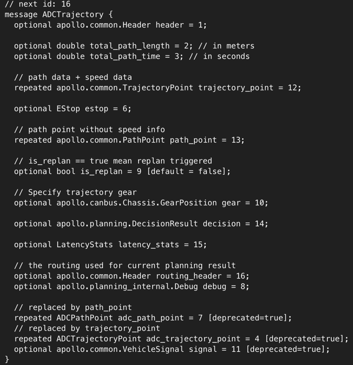
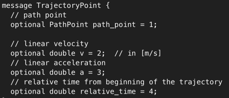
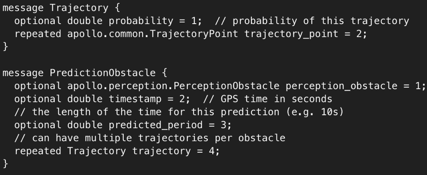
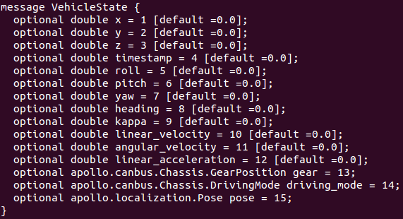
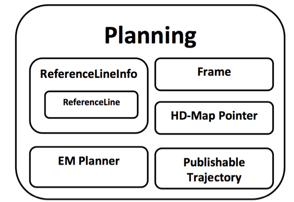

# Planning模块架构和概述

## 数据输入和输出

### 输出数据

Planning模块的输出数据类型定义在`planning.proto`，如下图所示：

#### *planning.proto*

在proto数据的定义中，输出数据包括总时间、总长度和确切的路径信息，输出数据由控制单元解析执行，输出数据结构定义在`repeated apollo.common.TrajectoryPointtrajectory_point`。

`trajectory point`类继承自`path_point`类，并新增了speed、acceleration和timing属性。
定义在`pnc_point.proto`中的`trajectory_point`包含了路径的详细属性。

除了路径信息，Planning模块输出了多种注释信息。主要的注释数据包括：

- Estop
- DecisionResult
- 调试信息

`Estop`是标示了错误和异常的指令。例如，当自动驾驶的车辆碰到了障碍物或者无法遵守交通规则时将发送estop信号。`DecisionResult`主要用于展示模拟的输出结果以方便开发者更好的了解Planning模块的计算结果。更多详细的中间值结果会被保存并输出作为调试信息供后续的调试使用。

## 输入数据

为了计算最终的输出路径，Planning模块需要统一的规划多个输入数据。Planning模块的输入数据包括：

- Routing
- 感知和预测
- 车辆状态和定位
- 高清地图

Routing定义了概念性问题“我想去哪儿”，消息定义在`routing.proto`文件中。`RoutingResponse`包含了`RoadSegment`，`RoadSegment`指明了车辆到达目的地应该遵循的路线。

关于概念性问题“我周围有什么”的消息定义在`perception_obstacles.proto`和`traffic_light_detection.proto`中。`perception_obstacles.proto`定义了表示车辆周围的障碍物的数据，车辆周围障碍物的数据由感知模块提供。`traffic_light_detection`定义了信号灯状态的数据。除了已被感知的障碍物外，动态障碍物的路径预测对Planning模块也是非常重要的数据，因此`prediction.proto`封装了`perception_obstacle`消息来表示预测路径。请参考下述图片：

每个预测的路径都有其单独的可能性，而且每个动态障碍物可能有多个预测路径。

除了概念性问题“我想去哪儿”和“我周围有什么”，另外一个重要的概念性问题是“我在哪”。关于该问题的数据通过高清地图和定位模块获得。定位信息和车辆车架信息被封装在`VehicleState`消息中，该消息定义在`vehicle_state.proto`，参考下述图片：

## 代码结构和类层次

代码组织方式如下图所示：Planning模块的入口是`planning.cc`。在Planning模块内部，重要的类在下图中展示。

`ReferenceLineInfo`对`ReferenceLine`类进行了封装，为Planning模块提供了平滑的指令执行序列。
**Frame**包含了所有的数据依赖关系，例如包含了预测路径信息的障碍物，自动驾驶车辆的状态等。
**HD-Ma**p在Planning模块内作为封装了多个数据的库使用，提供不同特点的地图数据查询需求。
**EM Planne**r执行具体的Planning任务，继承自**Planner**类。Apollo2.0中的**EM Planner**类和之前发布的**RTK Planner**类都继承自Planner类。

例如，在EM Planner执行的一次planning循环的内部，采用迭代执行的方法，tasks的三个类别交替执行。“**决策/优化**”类的关系在下述图片中展示：

- **Deciders** 包括 traffic decider, path decider and speed decider.

- **Path Optimizers** 为DP/QP path optimizers.

- **Speed Optimizers** 为DP/QP speed optimizers.

| **附注：**                                |
| ---------------------------------------- |
| DP表示动态规划（dynamic programming），QP表示二次规划（quadratic programming）。经过计算步骤后，最终的路径数据经过处理后传递到下一个节点模块进行路径的执行。 |
