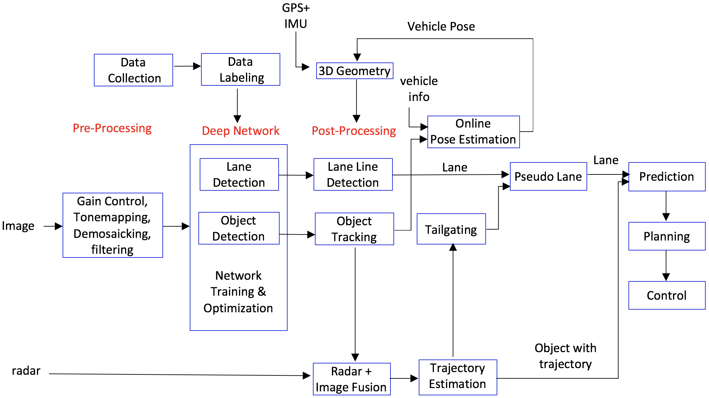

# 感知
Apollo 3.0
June 27, 2018

## 简介
Apollo 3.0 主要针对采用低成本传感器的L2级别自动驾驶车辆。在车道中的自动驾驶车辆通过一个前置摄像头和前置雷达要与关键车辆（在路径上最近的车辆）保持一定的距离。Apollo 3.0 支持在高速公路上不依赖地图的高速自动驾驶。深度网路学习处理图像数据，随着搜集更多的数据，深度网络的性能随着时间的推移将得到改善。

***安全警告***

Apollo 3.0 不支持没有包含本地道路和说明标示的急转弯道路。感知模块是基于采用深度网络并结合有限数据的可视化检测技术。因此，在我们发布更好的网络之前，驾驶员应该小心驾驶并控制好车辆方向而不能依赖与自动驾驶。请在安全和限制区域进行试驾。

- ***推荐道路***
	- ***道路两侧有清晰的白色车道线***

- ***禁止***
	- ***急转弯道路***
	- ***没有车道线标记的道路***
	- ***路口***
	- ***对接点或虚线车道线***
	- ***公共道路***

## 感知模块
每个模块的流程图如下所示。

**图 1: Apollo 3.0的流程图**

### 深度网络
深度网络摄取图像并为Apollo 3.0提供两个检测输出，车道线和对象。目前，对深度学习中使用单一任务还是协同训练任务还存在一些争议。诸如车道检测网络或物体检测网络的单一网络通常比一个协同训练的多任务网络执行得更好。然而，在给定有限资源的情况下，多个单独的网络将是昂贵的并且在处理中消耗更多时间。因此，对于经济设计而言，协同训练是不可避免的，并且在性能上会有一些妥协。在 Apollo 3.0, YOLO [1][2] 被用作对象和车道线检测的基础网络。该对象具有车辆、卡车、骑车人和行人类别，并由表示成具有方向信息的2-D边界框。通过使用具有一些修改的相同网络进行分段来检测车道线。对于整条车道线，我们有一个单独的网络，以提供更长的车道线，无论是车道线是离散的还是连续的。

### 物体识别/跟踪
在交通场景中，有两类物体: 静态物体和动态物体。静态物体包括车道线、交通信号灯以及数以千计的以各种语言写成的交通标示。除了驾驶之外，道路上还有多个地标，主要用于视觉定位，包括路灯，障碍物，道路上的桥梁或任何天际线。对于静态物体，Apollo 3.0将仅检测车道线.

在动态物体中，Apollo在路上关心乘用车，卡车，骑自行车者，行人或任何其他物体，包括动物或身体部位。Apollo还可以根据物体所在的车道对物体进行分类。最重要的物体是CIPV（路径中最近的物体）。下一个重要对象将是相邻车道中的物体。

#### 2D-to-3D 边界框

给定一个2D盒子，其3D大小和相机方向，该模块搜索相机坐标系统中的3D位置，并使用该2D盒子的宽度，高度或2D区域估计精确的3D距离。该模块可在没有准确的外部相机参数的情况下工作。

#### 对象跟踪

对象跟踪模块利用多种信息，例如3D位置，2D图像补丁，2D框或深度学习ROI特征。 跟踪问题通过有效地组合线索来表达为多个假设数据关联，以提供路径和检测到的对象之间的最正确关联，从而获得每个对象的正确ID关联。

### 车道检测/追踪
在静态对象中，我们在Apollo 3.0中将仅处理通道线。该车道用于纵向和横向控制。车道本身引导横向控制，并且在车道内的对象引导纵向控制。

#### 车道线
我们有两种类型的车道线，车道标记段和整个车道线。车道标记段用于视觉定位，整个车道线用于使车辆保持在车道内。
该通道可以由多组折线表示，例如下一个左侧车道线，左侧线，右侧线和下一个右侧线。给定来自深度网络的车道线热图，通过阈值化生成分段的二进制图像。该方法首先找到连接的组件并检测内部轮廓。然后，它基于自我车辆坐标系的地面空间中的轮廓边缘生成车道标记点。之后，它将这些车道标记与具有相应的相对空间（例如，左（L0），右（R0），下左（L1），下（右）（L2）等）标签的若干车道线对象相关联。

### CIPV (最近路径车辆)
CIPV是当前车道中最接近的车辆。对象由3D边界框表示，其从上到下视图的2D投影将对象定位在地面上。然后，检查每个对象是否在当前车道中。在当前车道的对象中，最接近的一个将被选为CIPV。

### 跟车
跟车是跟随前车的一种策略。从跟踪对象和当前车辆运动中，估计对象的轨迹。该轨迹将指导对象如何在道路上作为一组移动并且可以预测未来的轨迹。有两种跟车尾随，一种是跟随特定车辆的纯尾随，另一种是CIPV引导的尾随，当检测到无车道线时，当前车辆遵循CIPV的轨迹。 

输出可视化的快照如图2所示。 

**图 2: Apollo 3.0中感知输出的可视化。左上角是基于图像的输出。左下角显示了对象的3D边界框。右图显示了车道线和物体的三维俯视图。CIPV标有红色边框。黄线表示每辆车的轨迹**

### 雷达 + 摄像头融合
给定多个传感器，它们的输出应以协同方式组合。Apollo 3.0，介绍了一套带雷达和摄像头的传感器。对于此过程，需要校准两个传感器。每个传感器都将使用Apollo 2.0中介绍的相同方法进行校准。校准后，输出将以3-D世界坐标表示，每个输出将通过它们在位置，大小，时间和每个传感器的效用方面的相似性进行融合。在学习了每个传感器的效用函数后，摄像机对横向距离的贡献更大，雷达对纵向距离测量的贡献更大。异步传感器融合算法也作为选项提供。

### 伪车道
所有车道检测结果将在空间上临时组合以诱导伪车道，该车道将被反馈到规划和控制模块。某些车道线在某帧中不正确或缺失。为了提供平滑的车道线输出，使用车辆里程测量的历史车道线。当车辆移动时，保存每个帧的里程表，并且先前帧中的车道线也将保存在历史缓冲器中。检测到的与历史车道线不匹配的车道线将被移除，历史输出将替换车道线并提供给规划模块。

### 超声波传感器
Apollo 3.0支持超声波传感器。每个超声波传感器通过CAN总线提供被检测对象的距离。来自每个超声波传感器的测量数据被收集并作为ROS主题广播。将来，在融合超声波传感器后，物体和边界的地图将作为ROS的输出发布。

## 感知输出
PnC的输入将与之前基于激光雷达的系统的输入完全不同。

- 车道线输出
	- 折线和/或多项式曲线
	- 车道类型按位置：L1（左下车道线），L0（左车道线），R0（右车道线），R1（右下车道线

- 对象输出
	- 3D长方体
	- 相对速度和方向
	- 类型：CIPV，PIHP，其他
	- 分类：汽车，卡车，自行车，行人
	- Drops：物体的轨迹

世界坐标是3D中的当前车辆坐标，其中后中心轴是原点。

## 参考
[1] J Redmon, S Divvala, R Girshick, A Farhadi, "你只看一次：统一的实时物体检测" CVPR 2016

[2] J Redmon, A Farhadi, "YOLO9000: 更好, 更快, 更强," arXiv preprint
