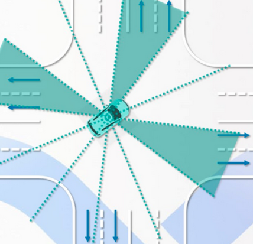

# PREDICTION EVALUATOR

# Introduction

The prediction module comprises 4 main functionalities: Container, Scenario, Evaluator and Predictor. 

The Evaluator predicts path and speed separately for any given obstacle. An evaluator evaluates a path by outputting a probability for it (lane sequence) using the given model stored in prediction/data/.

The list of available evaluators include:

- Cost evaluator: probability is calculated by a set of cost functions

- MLP evaluator: probability is calculated using an MLP model

- RNN evaluator: probability is calculated using an RNN model

- Cruise MLP + CNN-1d evaluator: probability is calculated using a mix of MLP and CNN-1d models for the cruise scenario

- Junction MLP evaluator: probability is calculated using a MLP model for junction scenario

- Junction Map evaluator: probability is calculated using an semantic map-based CNN model for junction scenario. This evaluator was created for caution level obstacles

- Social Interaction evaluator: this model is used for pedestrians, for short term trajectory prediction. It uses social LSTM. This evaluator was created for caution level obstacles

- Semantic LSTM evaluator: this evaluator is used in the new Caution Obstacle model to generate short term trajectory points which are calculated using CNN and LSTM. Both vehicles and pedestrians are using this same model, but with different parameters


# Where is the code

Please refer [prediction evaluator](https://github.com/ApolloAuto/apollo/modules/prediction/evaluator).

# Code Reading

## Solcial interaction evaluator
1. The evaluator uses social LSTM to predict short-term trajectroy for pedestrians with caution level. In the code, the evaluator is named by pedestrain interaction evalutor.

2. Extract features from obstacles.

    ```cpp 
    bool ExtractFeatures(const Obstacle* obstacle_ptr,
                       std::vector<double>* feature_values);
    ```

3. Using social LSTM module to predict short-term trajectory by following steps:
  - Get social embedding
  - Get position embedding
  - Conduct single LSTM and update hidden states
  - Get a predicted trajectory

## Semantic LSTM evaluator
1. Get and process feature map by obstacles'id.

2. Build input features for torch.

3. Get predicted trajectory with different parameters for different types of obstacles.

## Junction map evaluator
1. Only care about obstalces at intersections. Obstacles are not closed to any junction exit cannot be evaluated by this evaluator. 

2. Take the obstacle as the center and the orientation as the reference direction, 12 fan-shaped areas are divided.
  

3. Since the juction exit is associated with these 12 fan-shaped areas, the probability can be calculated by solving the fan-shaped areas classification problem.

4. Assign all lane sequence probability.

## Junction mlp evaluator
1. Using a MLP model to solve the classification problem mentioned in junction map evaluator.

